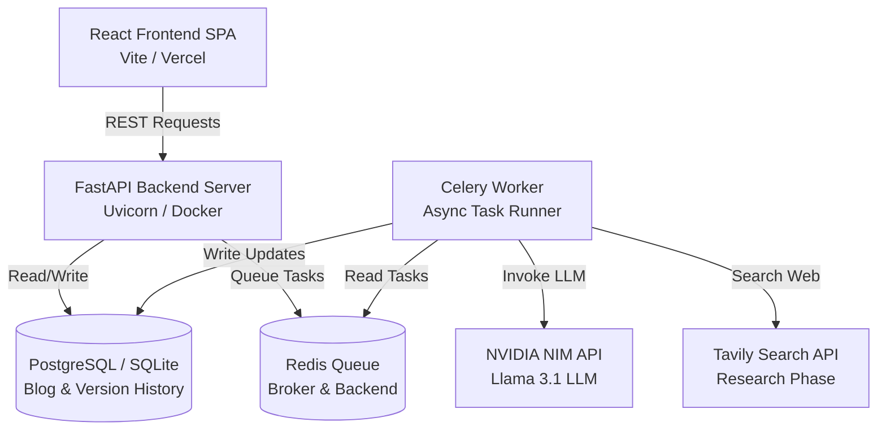
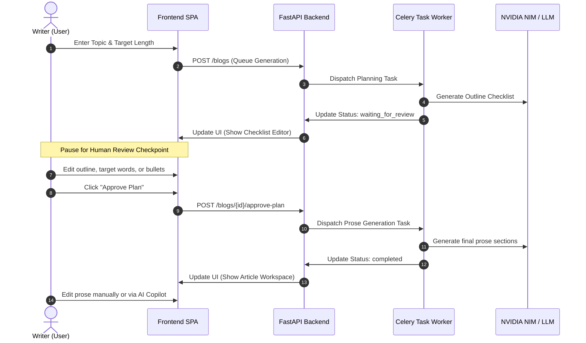

# QuillOps: The Operating System for Technical Writing

QuillOps is an agentic AI operations platform designed to orchestrate intelligent workflows for research, planning, review, generation, and refinement of publication-ready technical blog articles. By putting a durable human-in-the-loop checkpoint at the structural planning stage, QuillOps avoids AI drift and guarantees that high-quality, editorially balanced content is produced.

---

## 1. System Architecture

The following diagram illustrates the interaction between the React Single Page Application (SPA), the FastAPI backend server, database engines, task queues, and external APIs.



---

## 2. Agentic Workflow Process Flow

QuillOps operates on a durable staged execution model that pauses for review before generating prose.



---

## 3. Directory Layout

```text
QuillOps/
├── backend.py            # LangGraph agent planning & generation graphs
├── auth.py               # JWT tokens, cryptography, and user dependency injection
├── database.py           # SQLAlchemy setup (Postgres/SQLite engines)
├── models.py             # Database model definitions (User, Blog, BlogVersion)
├── schemas.py            # Pydantic validation schemas
├── main.py               # FastAPI routers and endpoints
├── tasks.py              # Celery task definitions (Planning & Generation)
├── vercel.json           # Vercel deployment configurations
├── docker-compose.yml    # Docker container stack configuration
├── Dockerfile            # API container image manifest
├── requirements.txt      # Python dependencies
├── tsconfig.json         # TypeScript configuration
├── package.json          # Node dependencies and npm scripts
├── tests/                # Test suites
│   ├── test_planning.py  # Backend planning tests
│   ├── test_generation.py# Backend generation tests
│   └── *.test.mjs        # Frontend unit tests
└── frontend/             # Frontend Single Page Application source code
    ├── index.html        # Main static HTML frame
    ├── styles.css        # Core design system stylesheet
    ├── js/               # Legacy routing/shell controllers
    └── src/              # React workspace components
        ├── entry.tsx     # React component bundle entry
        ├── components/   # Modular dashboard, review, and article panels
        └── landing.css   # Dynamic layout adjustments and dark overrides
```

---

## 4. Local Prerequisites

Before setting up QuillOps locally, ensure you have installed:
*   **Docker** & **Docker Compose**
*   *Alternatively (for local execution without Docker)*:
    *   **Python 3.11+**
    *   **Node.js 18+**
    *   **Redis Server** (listening on `localhost:6379`)

---

## 5. Local Quickstart (Docker Compose)

The easiest way to start the complete stack is using Docker Compose:

1.  Copy the environment template:
    ```bash
    cp .env.example .env
    ```
2.  Fill in the environment secrets inside `.env`:
    *   `NVIDIA_API_KEY`: Your NVIDIA NIM token.
    *   `TAVILY_API_KEY`: Your Tavily search credential.
    *   `JWT_SECRET`: A secure cryptographically random secret string.
3.  Launch the services:
    ```bash
    docker compose up --build
    ```
4.  Once running:
    *   Frontend & Backend API Server: `http://localhost:8000/`
    *   Interactive API Docs: `http://localhost:8000/docs`

---

## 6. Manual Setup (Without Docker)

To run the backend, worker, and frontend components separately for local development:

### 1. Backend API Server Setup
1.  Initialize a virtual environment and install dependencies:
    ```bash
    python -m venv venv
    venv\Scripts\activate      # On Windows
    source venv/bin/activate   # On macOS/Linux
    pip install -r requirements.txt
    ```
2.  Configure `.env` with SQLite and local Redis:
    ```env
    DATABASE_URL=sqlite:///./quillops.db
    REDIS_URL=redis://localhost:6379/0
    ```
3.  Launch the API server:
    ```bash
    uvicorn main:app --reload --host 127.0.0.1 --port 8000
    ```

### 2. Background Worker Setup
1.  With Redis running locally on `6379`, start the Celery task queue:
    ```bash
    celery -A tasks.celery_app worker --loglevel=INFO --concurrency=1
    ```

### 3. Frontend Development & Build Setup
1.  Install packages:
    ```bash
    npm install
    ```
2.  Start the Vite watch development server:
    ```bash
    npm run dev
    ```
3.  Compile static assets for production deployment:
    ```bash
    npm run build
    ```

---

## 7. Running Tests

### Backend Unit Tests
Run backend tests with an explicit SQLite database configuration:
```bash
$env:DATABASE_URL="sqlite:///./quillops_test.db"  # Windows PowerShell
python -m unittest discover tests
```

### Frontend Unit Tests
Run the frontend test suite using Node's test runner:
```bash
npm run test:frontend
```

---

## 8. Deployment Configurations

### Frontend (Vercel)
Deploying the static React SPA frontend to Vercel requires configuring the project directly from the repository root:
1.  **Vercel Build Command**: `npm run build`
2.  **Vercel Output Directory**: `frontend`
3.  **Vercel Root Directory**: `/` (Keep root to allow access to root configuration files and `package.json`).

Vercel will automatically run Vite compilation and serve the compiled SPA directly from the `frontend/` directory.

### Backend (Docker/Render/Heroku)
The backend container should be hosted on a cloud engine supporting persistent service processes:
*   The **API Service** runs the main web process (`uvicorn main:app --host 0.0.0.0 --port 8000`).
*   The **Worker Service** runs the background execution loop (`celery -A tasks.celery_app worker --loglevel=INFO --concurrency=1`).
*   Provide a persistent **PostgreSQL** database instance and a **Redis** cache container.

> [!CAUTION]
> **Security Notice**: Never commit `.env` files or active API tokens to GitHub. Ensure all secrets are registered directly as secure environment variables in Vercel and your backend hosting engine.
